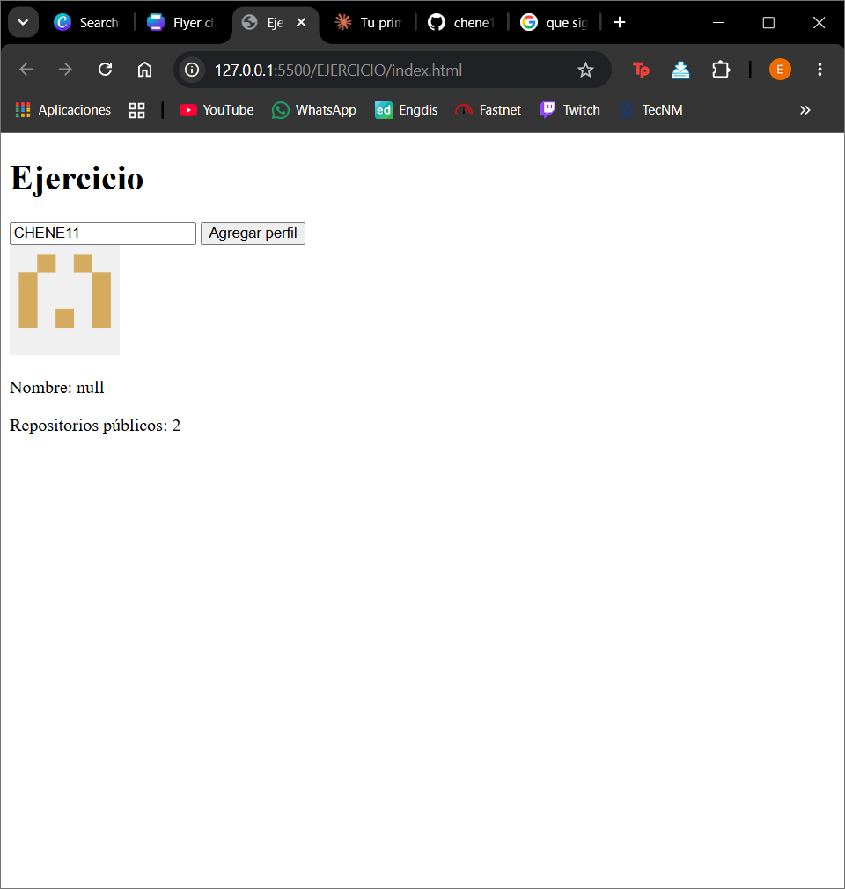

# Buscador de usuarios de GitHub

App web que permite buscar perfiles de GitHub y mostrar su información básica.

## ¿Qué hace?

- Busca cualquier usuario de GitHub por su nombre de usuario
- Muestra su foto de perfil, nombre y número de repositorios públicos
- Muestra un mensaje de error si el usuario no existe

## Tecnologías usadas

- HTML
- CSS
- JavaScript (fetch, async/await, destructuring)

## ¿Cómo usarlo?

1. Escribe un nombre de usuario de GitHub en el campo de texto
2. Haz clic en "Agregar perfil"
3. Los datos del usuario aparecerán en pantalla

## Captura de pantalla

